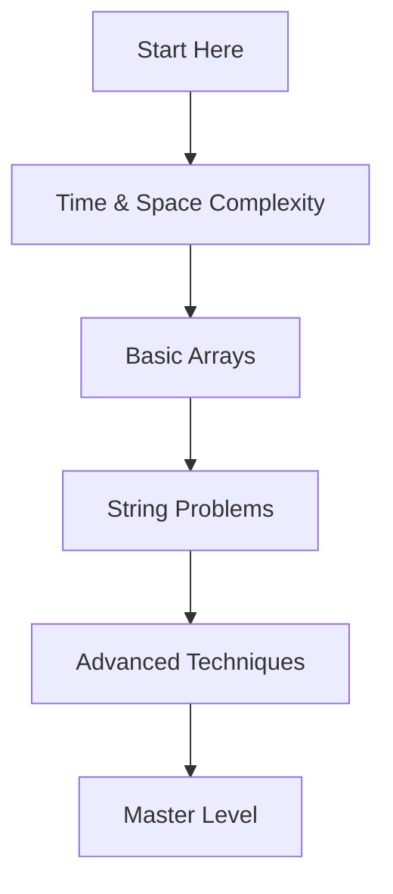

# 🎯 Getting Started

## Welcome! 👋

This is your journey from beginner to advanced in Data Structures and Algorithms using Python.

## 🗺️ Learning Path

## 📋 Prerequisites

### What You Need to Know
- ✅ Basic Python syntax
- ✅ For loops and while loops
- ✅ Functions
- ✅ Lists and dictionaries

### What You'll Learn
- ⭐ Algorithm analysis
- ⭐ Problem-solving patterns
- ⭐ Optimization techniques
- ⭐ Interview-ready coding

## 🎓 Study Strategy

### 1. Read the Concept
Each topic starts with clear explanation and intuition

### 2. Understand the Pattern
See the approach and why it works

### 3. Study the Dry Run
Follow step-by-step execution with examples

### 4. Copy the Code
Ready-to-use, clean code snippets

### 5. Practice Variations
Try similar problems to solidify understanding

## 🚀 Start Learning

**Ready to begin?** → [[01-Time-and-Space-Complexity]]

## 📚 Module Navigation

| Module | Topic | Difficulty |
|--------|-------|------------|
| 1 | [[01-Time-and-Space-Complexity]] | Beginner |
| 1 | [[02-Basic-Array-Operations]] | Beginner |
| 2 | [[03-Character-Frequency-Problems]] | Beginner |
| 2 | [[04-String-Dictionary-Problems]] | Intermediate |
| 3 | [[05-Prefix-Sum-Technique]] | Intermediate |
| 3 | [[06-Two-Pointer-Technique]] | Intermediate |
| 3 | [[07-Array-Manipulation-Advanced]] | Intermediate |
| 4 | [[08-Kadanes-Algorithm]] | Advanced |
| 4 | [[09-Bit-Manipulation]] | Advanced |
| 4 | [[10-Sliding-Window]] | Advanced |

## 💡 Tips for Success

### ✅ DO
- Read the explanation first, then look at code
- Draw diagrams for complex problems
- Practice dry running with your own examples
- Understand WHY, not just HOW
- Review previous topics regularly

### ❌ AVOID
- Memorizing code without understanding
- Skipping the dry run examples
- Moving to next topic without mastering current one
- Ignoring time/space complexity analysis
- Copying code without typing it yourself

## 🎯 Goals

By the end of this course, you will:
- ✨ Understand core DSA patterns
- ✨ Solve LeetCode medium problems confidently
- ✨ Optimize code for time and space
- ✨ Think like a problem solver
- ✨ Be interview-ready

---

**Let's start!** → [[01-Time-and-Space-Complexity]]

Back to: [[README DSA Complete]]
