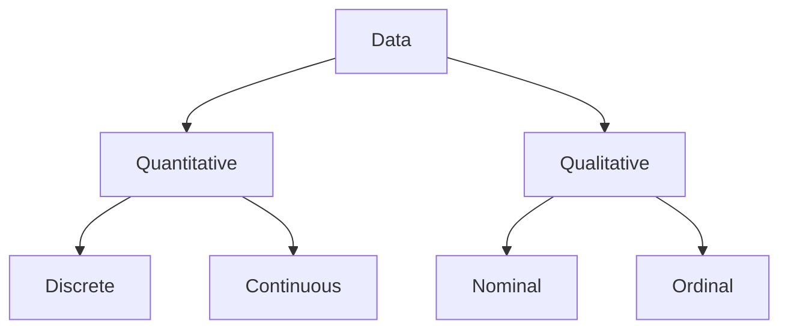

# 📊 Data Types & Collection - Complete Notes

> [!INFO] **Definition: Data**
> A collection of facts, figures, values that can be recorded, stored, and processed to get information. Data itself has no meaning until organized or analyzed.

**Example:** Numbers like 75, 90, 65, 82 are just data until we analyze them as "test scores"

---

## 📌 Types of Data

---

## 📌 1. Quantitative Data (Numerical)

> [!INFO] **Definition: Quantitative Data**
> Data that can be **measured, counted, and expressed in numbers**.

### Discrete Data
> **Countable** values with whole numbers only (no decimals/fractions).

| Examples | Why Discrete? |
|----------|---------------|
| Number of students in class (45, 46) | Can't have 45.5 students |
| Number of cars | Can't have 2.3 cars |
| Programming languages you know | Can't know 3.7 languages |

**Key Point:** You **count** discrete data

---

### Continuous Data
> **Measurable** values that can take any value within a range (including decimals).

| Examples | Why Continuous? |
|----------|-----------------|
| Height of student (172.5 cm) | Can be 172.53... cm |
| Time to run program (2.36 sec) | Can be 2.364... sec |
| Temperature (27.8°C) | Can be 27.82... °C |

**Key Point:** You **measure** continuous data with precision

---

## 📌 2. Qualitative Data (Categorical)

> [!INFO] **Definition: Qualitative Data**
> Non-numerical data that describes **qualities or characteristics**. Answers "what kind" not "how much".

### Nominal Data (Without Order)
> Categories that are just **names or labels** with no logical order.

| Examples | Why Nominal? |
|----------|--------------|
| Gender (Male/Female/Other) | No order |
| Blood group (A, B, AB, O) | Can't rank them |
| Programming language (Python, C++, Java) | No inherent order |

**Key Point:** Cannot be ranked or ordered

---

### Ordinal Data (With Order)
> Categories with a **logical order or ranking**.

| Examples | Why Ordinal? |
|----------|--------------|
| Class rank (1st, 2nd, 3rd) | Clear order |
| Feedback (Excellent, Good, Average, Poor) | Can be ranked |
| Education (High school, Graduate, Postgraduate) | Progressive order |

**Key Point:** Can be ordered/ranked

---

## 📌 Quick Comparison Table

| Type | Sub-Type | Example | Can Measure? | Can Order? |
|------|----------|---------|--------------|------------|
| **Quantitative** | Discrete | Number of students: 45 | ✅ Yes | ✅ Yes |
| **Quantitative** | Continuous | Height: 172.5 cm | ✅ Yes | ✅ Yes |
| **Qualitative** | Nominal | Gender: Male/Female | ❌ No | ❌ No |
| **Qualitative** | Ordinal | Rank: 1st, 2nd, 3rd | ❌ No | ✅ Yes |

---

## 📌 Sources of Data

### Primary Data (First-Hand)

> [!INFO] **Definition: Primary Data**
> Data collected **directly from the source** for a specific purpose. Original, fresh data.

**Collection Methods:**
- 📋 Surveys & Questionnaires
- 🎤 Interviews
- 👁️ Direct observation
- 🧪 Experiments

**Example:**
- You personally survey 100 students about their study hours
- You conduct experiments in lab

**Advantages:**
- ✅ Specific to your needs
- ✅ Reliable and accurate
- ✅ Up-to-date

**Disadvantages:**
- ❌ Time-consuming
- ❌ Expensive
- ❌ Requires expertise

---

### Secondary Data (Second-Hand)

> [!INFO] **Definition: Secondary Data**
> Data already collected and published by **someone else**. Saves time and effort.

**Sources:**
- 📊 Census reports
- 🏛️ Government publications
- 📄 Research papers
- 📚 Books, articles, websites
- 💾 Kaggle datasets

**Example:**
- Census of India data on literacy rate
- WHO statistics on health

**Advantages:**
- ✅ Saves time
- ✅ Cost-effective
- ✅ Easily available

**Disadvantages:**
- ❌ May not fit your exact needs
- ❌ Might be outdated
- ❌ Possible accuracy issues

---

## 📌 Population vs Sample

### Population

> [!INFO] **Definition: Population**
> The **entire group** you are interested in studying. Includes every single individual that fits your criteria. The complete set.

**Examples:**
- 🏫 All students in your school
- 🏭 All smartphones produced by a factory
- 🌍 All voters in a country

**Parameter:** Summary measure of population (μ, σ)

---

### Sample

> [!INFO] **Definition: Sample**
> A **smaller group selected** from the population. A subset meant to represent the larger population.

**Examples:**
- 🏫 100 students randomly selected from your school
- 🏭 100 smartphones tested from production line
- 🌍 1000 voters surveyed

**Statistic:** Summary measure of sample (x̄, s)

---

## 📌 Why Use Samples?

| Reason | Explanation |
|--------|-------------|
| **Cost** | Cheaper than studying entire population |
| **Time** | Faster to collect and analyze |
| **Practicality** | Often impossible to study entire population |
| **Accuracy** | Well-chosen sample can be very accurate |

**Example:** Testing 100 smartphones is cheaper and faster than testing all 1 million produced!

---

## 💻 Practical Examples

### Example 1: Classify Each Data Type

| Data | Type | Sub-Type |
|------|------|----------|
| Number of books read: 5 | Quantitative | Discrete |
| Temperature: 27.5°C | Quantitative | Continuous |
| Favorite color: Blue | Qualitative | Nominal |
| Class grade: A, B, C | Qualitative | Ordinal |

---

### Example 2: Primary vs Secondary

**Scenario:** You want to study student satisfaction with online classes.

| Data Source | Type |
|-------------|------|
| Survey 200 students yourself | **Primary** ✅ |
| Use university's existing report | **Secondary** |
| Interview 50 students | **Primary** ✅ |
| Government education statistics | **Secondary** |

---

### Example 3: Population vs Sample

**Scenario:** Study average height of students in college.

| Group | Type |
|-------|------|
| All 5000 students in college | **Population** |
| 500 randomly selected students | **Sample** ✅ (practical choice) |

---

## 🧠 Key Points
- **Quantitative** = Numbers (Discrete = count, Continuous = measure)
- **Qualitative** = Categories (Nominal = no order, Ordinal = has order)
- **Primary** = You collect (expensive, specific)
- **Secondary** = Others collected (cheap, may not fit)
- **Population** = Everyone (complete)
- **Sample** = Selected few (representative)

---

## ❓ 5 Questions to Test Yourself

> [!QUESTION] Q1: Is "number of students" discrete or continuous?
>> [!SUCCESS]- Answer
>> **Discrete** - you can't have 45.5 students, only whole numbers.

> [!QUESTION] Q2: What's the difference between Nominal and Ordinal?
>> [!SUCCESS]- Answer
>> **Nominal** = No order (colors, gender). **Ordinal** = Has order (ranks, grades).

> [!QUESTION] Q3: Is a survey you conduct Primary or Secondary data?
>> [!SUCCESS]- Answer
>> **Primary** - you're collecting it directly from the source.

> [!QUESTION] Q4: Why use a Sample instead of Population?
>> [!SUCCESS]- Answer
>> **Cheaper, faster, and often impossible** to study entire population.

> [!QUESTION] Q5: Is temperature Discrete or Continuous?
>> [!SUCCESS]- Answer
>> **Continuous** - can be 27.8°C, 27.82°C, measured with precision.

---

[[2-Sets-and-Functions|← Previous]] | [[Math-AI-ML-Hub|🏠 Hub]]
