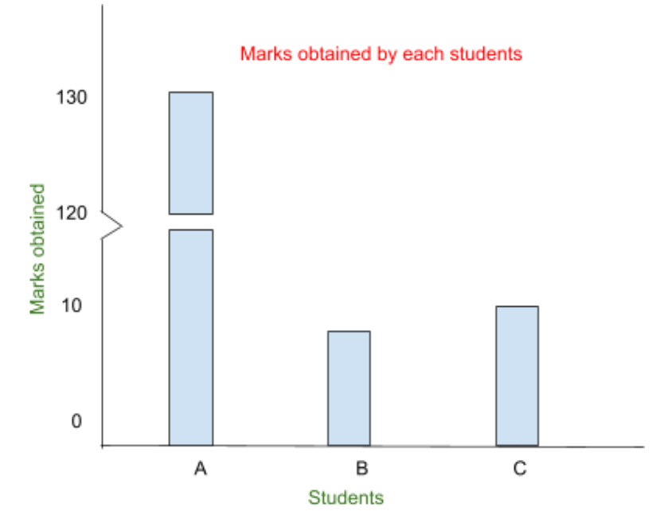

# 📊 Tabulation & Diagrams - Complete Notes

> [!TIP] **Obsidian Plugins for Better Charts**
> 1. **Charts** by phibr0 ⭐ (Most popular - 266K downloads)
>    - Easily create interactive charts
> 2. **Charts View** by caronchen (72K downloads)
>    - Visualize data with plots and graphs
> 3. **echarts** by windily-cloud (8K downloads)
>    - Render echarts
> 
> Install via: Settings → Community Plugins → Browse → Search "Charts"
> 
> **Note:** Mermaid diagrams work **natively** in Obsidian - no plugin needed!

---

## 📌 General Rules for Graph Construction

| Rule | Description |
|------|-------------|
| **1. Title** | Clear descriptive title showing purpose |
| **2. Proportion** | Appropriate height-to-width ratio |
| **3. Scale** | Use appropriate, consistent scale |
| **4. Footnotes** | Add explanatory notes if needed |
| **5. Index/Legend** | Clear labels and legend |
| **6. Neatness** | Clean, professional appearance |
| **7. Simplicity** | Easy to understand at a glance |

---

## 📌 BAR DIAGRAM

> [!INFO] **Definition: Bar Diagram**
> A series of rectangular bars where the **length is proportional to the value** it represents. Bars can be vertical or horizontal.

**Purpose:** Compare frequency, count, or measures across different categories.

---

### 1. Simple Bar Graph

> **Definition:** Bars of uniform width, each representing a single value/category.

**When to Use:** Compare values of different categories at single point in time.

**Example:** Algorithm Performance Comparison

| Algorithm | QuickSort | MergeSort | HeapSort | BubbleSort |
|-----------|-----------|-----------|----------|------------|
| Time (ms) | 45 | 52 | 68 | 420 |

````chart
type: bar
labels: [QuickSort, MergeSort, HeapSort, BubbleSort]
series:
  - title: Execution Time (ms)
    data: [45, 52, 68, 420]
tension: 0.2
width: 80%
labelColors: false
fill: false
beginAtZero: true
````

**Answer:** **QuickSort** shows best performance (45ms - lowest time)

---

### 2. Subdivided Bar Diagram (Stacked Bar)

> **Definition:** Each bar divided into component parts showing total AND individual contributions.

**When to Use:** Show composition of each category.

**Example:** Student Marks Distribution (Python, Maths, DSA)

````chart
type: bar
labels: [Student A, Student B, Student C]
series:
  - title: Maths
    data: [10, 7, 12]
    backgroundColor: 'rgba(255, 107, 107, 0.5)'
  - title: Python
    data: [5, 6, 4]
    backgroundColor: 'rgba(78, 205, 196, 0.5)'
  - title: DSA
    data: [5, 0, 0]
    backgroundColor: 'rgba(255, 230, 109, 0.5)'
stacked: true
tension: 0.2
width: 80%
labelColors: true
fill: false
beginAtZero: true
````

**Legend:**
- 🟥 Red = Maths
- 🟦 Blue = Python  
- 🟨 Yellow = DSA

---

### 3. Multiple Bar Diagram

> **Definition:** Two or more sets of bars grouped together for each category.

**When to Use:** Compare different variables across same categories.

**Example:** Student Marks in Different Subjects

| Student | DSA | Python | Maths |
|---------|-----|--------|-------|
| A | 19 | 9 | 14 |
| B | 13 | 9 | 12 |

````chart
type: bar
labels: [Student A, Student B]
series:
  - title: DSA
    data: [19, 13]
    backgroundColor: 'rgba(255, 107, 107, 0.3)'
  - title: Python
    data: [9, 9]
    backgroundColor: 'rgba(78, 205, 196, 0.3)'
  - title: Maths
    data: [14, 12]
    backgroundColor: 'rgba(255, 230, 109, 0.3)'
tension: 0.2
width: 80%
labelColors: true
fill: false
beginAtZero: true
````

**Interpretation:** Each student has 3 bars with the **same 3 colors**:
- � Red = DSA
- 🟦 Blue = Python
- � Yellow = Maths

Both Student A and Student B use these same 3 colors for easy comparison.

---

### 4. Percentage Bar Diagram

> **Definition:** All bars equal height (100%), components shown as percentages.

**When to Use:** Compare proportional composition across categories.

**Example:** Student Marks as Percentages

| Student | Maths % | Python % | DSA % |
|---------|---------|----------|-------|
| A | 40% | 20% | 40% |
| B | 10% | 40% | 50% |
| C | 50% | 20% | 30% |

````chart
type: bar
labels: [Student A, Student B, Student C]
series:
  - title: Maths
    data: [40, 10, 50]
    backgroundColor: 'rgba(255, 107, 107, 0.3)'
  - title: Python
    data: [20, 40, 20]
    backgroundColor: 'rgba(78, 205, 196, 0.3)'
  - title: DSA
    data: [40, 50, 30]
    backgroundColor: 'rgba(255, 230, 109, 0.3)'
stacked: true
tension: 0.2
width: 80%
labelColors: true
fill: false
beginAtZero: true
dataLabels: true
````

**Note:** All bars reach 100% total height. Percentages are displayed inside each colored section.

**Color Legend:**
- 🟥 Red = Maths
- 🟦 Blue = Python
- 🟨 Yellow = DSA

---

### 5. Deviation Bar Diagram

> **Definition:** Shows positive/negative deviations from baseline/target.

**When to Use:** Net profit, net sales, variance analysis, performance vs target.

**Example:** Student Performance (Deviation from Average)

| Student | DSA | Python | Maths |
|---------|-----|--------|-------|
| A | +19 | -9 | +14 |
| B | -15 | -10 | +12 |

````chart
type: bar
labels: [Student A, Student B]
series:
  - title: DSA
    data: [19, -15]
    backgroundColor: 'rgba(255, 230, 109, 0.8)'
  - title: Python
    data: [-9, -10]
    backgroundColor: 'rgba(78, 205, 196, 0.8)'
  - title: Maths
    data: [14, 12]
    backgroundColor: 'rgba(255, 107, 107, 0.8)'
tension: 0.2
width: 80%
labelColors: true
fill: false
beginAtZero: false
````

**Interpretation:** 
- Bars above 0 = **Positive deviation** (above average/target)
- Bars below 0 = **Negative deviation** (below average/target)

**Color Legend:**
- 🟨 Yellow = DSA
- 🟦 Blue = Python
- 🟥 Red = Maths

---

### 6. Broken Bar Diagram

> **Definition:** Very large values represented by broken bars to prevent scale distortion.

**When to Use:** When one value is extremely large compared to others.

**Example:** Student Marks (Student A has exceptionally high marks)

| Student | Marks |
|---------|-------|
| A | 130 |
| B | 8 |
| C | 10 |

**Visual Representation:**



**Explanation:**
- **Student A**: Bar has a **break (~~)** showing the scale jump from 10 to 120
- **Student B**: Normal bar showing 8 marks
- **Student C**: Normal bar showing 10 marks

**Purpose:** The break prevents Student A's extremely high value (130) from making Students B and C's bars (8, 10) appear too small to read.

---

## 📌 PIE DIAGRAM

> [!INFO] **Definition: Pie Diagram**
> A circular chart divided into slices where arc length (and angle) is proportional to the quantity. Total circle = 100%.

**When to Use:** Resource allocation, survey results, composition data

---

### Steps to Create Pie Chart

**Step 1:** Calculate percentage of total
```
Percentage = (Value / Total) × 100
```

**Step 2:** Calculate angles
```
Angle = (Percentage / 100) × 360°
```

**Step 3:** Draw diagram

---

### Example: Material Composition

**Scenario:** Composite Alloy Material Distribution

| Material | Aluminium | Copper | Zinc |
|----------|-----------|--------|------|
| Amount | 50 | 30 | 20 |

**Solution:**

**Step 1: Percentages**
- Total = 100
- Aluminium = (50/100) × 100 = **50%**
- Copper = (30/100) × 100 = **30%**
- Zinc = (20/100) × 100 = **20%**

**Step 2: Angles**
- Aluminium = 50% of 360° = **180°**
- Copper = 30% of 360° = **108°**
- Zinc = 20% of 360° = **72°**

**Step 3: Pie Chart**

````chart
type: pie
labels: [Aluminium, Copper, Zinc]
series:
  - title: Material Composition
    data: [50, 30, 20]
width: 80%
labelColors: true
````

**Angle Distribution:**
- Aluminium: 180° (50%)
- Copper: 108° (30%)  
- Zinc: 72° (20%)

---

## 📌 Limitations of Pie Diagram

| Limitation | Issue | Better Alternative |
|------------|-------|-------------------|
| **Close Values** | Hard to judge 21% vs 23% | Bar diagram |
| **Too Many Slices** | Messy, small percentages invisible | Bar/Line chart |
| **Exact Values** | Can't read precise numbers | Table or Bar chart |

**Rule of Thumb:** Use pie charts for **≤ 5-6 categories**

---

## 💻 Solved Example: Project Hours Allocation

**Question:** Project hours allocated in ratio 4:2:2:3:5 for Design, Development, Testing, Documentation, Deployment.

**Given:** Testing team = 200 hours

---

### Solution:

**Step 1: Understand Ratio**
```
Design : Development : Testing : Documentation : Deployment
  4    :      2       :   2    :       3        :     5
```

**Step 2: Find Total Parts**
```
Total parts = 4 + 2 + 2 + 3 + 5 = 16 parts
```

**Step 3: Find Value of 1 Part**
```
Testing = 2 parts = 200 hours
1 part = 200 / 2 = 100 hours
```

**Step 4: Calculate Total Project Hours**
```
Total = 16 parts × 100 = 1600 hours
```

**Step 5: Calculate Each Team's Hours**

| Team | Ratio | Parts | Hours | Calculation |
|------|-------|-------|-------|-------------|
| Design | 4 | 4 | 400 | 4 × 100 |
| Development | 2 | 2 | 200 | 2 × 100 |
| Testing | 2 | 2 | 200 | 2 × 100 |
| Documentation | 3 | 3 | 300 | 3 × 100 |
| Deployment | 5 | 5 | 500 | 5 × 100 |
| **Total** | **16** | | **1600** | |

---

**Step 6: Calculate Percentages**

| Team | Percentage | Calculation |
|------|------------|-------------|
| Design | 25% | (400/1600) × 100 |
| Development | 12.5% | (200/1600) × 100 |
| Testing | 12.5% | (200/1600) × 100 |
| Documentation | 18.75% | (300/1600) × 100 |
| Deployment | 31.25% | (500/1600) × 100 |

---

**Step 7: Calculate Angles**

| Team | Angle | Calculation |
|------|-------|-------------|
| Design | 90° | 25% × 360° |
| Development | 45° | 12.5% × 360° |
| Testing | 45° | 12.5% × 360° |
| Documentation | 67.5° | 18.75% × 360° |
| Deployment | 112.5° | 31.25% × 360° |

---

**Step 8: Pie Chart**

````chart
type: pie
labels: [Design, Development, Testing, Documentation, Deployment]
series:
  - title: Project Hours Allocation
    data: [25, 12.5, 12.5, 18.75, 31.25]
width: 80%
labelColors: true
````

**Breakdown Table:**

| Team | Hours | Percentage | Angle |
|------|-------|------------|-------|
| Design | 400 | 25% | 90° |
| Development | 200 | 12.5% | 45° |
| Testing | 200 | 12.5% | 45° |
| Documentation | 300 | 18.75% | 67.5° |
| Deployment | 500 | 31.25% | 112.5° |
| **Total** | **1600** | **100%** | **360°** |

---

## 📌 TIME SERIES & LINE GRAPH

> [!INFO] **Definition: Time Series**
> A sequence of data points collected or recorded at specific, consistent time intervals.

> [!INFO] **Definition: Line Graph**
> A chart that displays information as data points connected by straight line segments. Most common way to visualize time series.

**Components:**
- **X-Axis:** Almost always represents time (days, months, years)
- **Y-Axis:** Represents the measured value (price, temperature, sales, etc.)

**Use Case:** Provide clear visual story of how a value changes over time. Makes trends, peaks, troughs, and cycles immediately apparent.

---

### Example 1: Sales Over Years

| Year | 2014 | 2015 | 2016 | 2017 | 2018 |
|------|------|------|------|------|------|
| Sales (₹L) | 2 | 4 | 3 | 4.5 | 4 |

````chart
type: line
labels: [2014, 2015, 2016, 2017, 2018]
series:
  - title: Sales (₹ in Lakhs)
    data: [2, 4, 3, 4.5, 4]
tension: 0.2
width: 80%
labelColors: false
fill: false
beginAtZero: true
````

---

### Example 2: Daily Maximum Temperatures

**Question:** Daily maximum temperatures (°C) for a city over a week:

| Day | Mon | Tue | Wed | Thu | Fri | Sat | Sun |
|-----|-----|-----|-----|-----|-----|-----|-----|
| Temp | 22 | 25 | 28 | 30 | 32 | 29 | 26 |

````chart
type: line
labels: [Mon, Tue, Wed, Thu, Fri, Sat, Sun]
series:
  - title: Temperature (°C)
    data: [22, 25, 28, 30, 32, 29, 26]
tension: 0.3
width: 80%
labelColors: false
fill: false
beginAtZero: false
````

**Observation:** Temperature peaks on Friday (32°C) and drops over the weekend.

---

### Example 3: Quarterly Revenue

**Question:** Company's quarterly revenue (in millions) for 2 years:

| Quarter | Q1'22 | Q2'22 | Q3'22 | Q4'22 | Q1'23 | Q2'23 | Q3'23 | Q4'23 |
|---------|-------|-------|-------|-------|-------|-------|-------|-------|
| Revenue | 5 | 6.2 | 5.8 | 7.5 | 7.0 | 8.5 | 8.0 | 10.2 |

````chart
type: line
labels: [Q1'22, Q2'22, Q3'22, Q4'22, Q1'23, Q2'23, Q3'23, Q4'23]
series:
  - title: Revenue (₹ Millions)
    data: [5, 6.2, 5.8, 7.5, 7.0, 8.5, 8.0, 10.2]
tension: 0.3
width: 80%
labelColors: false
fill: false
beginAtZero: true
````

**Trend:** Steady growth from Q4'22 to Q4'23, with peak revenue of ₹10.2M in Q4'23.

---

## 📌 HISTOGRAM

> [!INFO] **Definition: Histogram**
> A graphical representation showing the distribution of numerical data by displaying frequency within consecutive, non-overlapping intervals (bins).

### Difference: Histogram vs Bar Graph

| Feature | Bar Graph | Histogram |
|---------|-----------|-----------|
| **Data Type** | Categorical data | Continuous numerical data |
| **X-Axis** | Discrete categories | Numerical ranges (bins) |
| **Bars** | Have gaps between them | Touch each other |
| **Order** | Can be rearranged | Must be in numerical order |

---

### Example: Histogram

| C.I | 0-5 | 5-10 | 10-15 | 15-20 | 20-25 | 25-30 |
|-----|-----|------|-------|-------|-------|-------|
| F | 2 | 3 | 5 | 3 | 4 | 3 |

````chart
type: bar
labels: [0-5, 5-10, 10-15, 15-20, 20-25, 25-30]
series:
  - title: Frequency
    data: [2, 3, 5, 3, 4, 3]
    backgroundColor: 'rgba(100, 150, 200, 0.7)'
tension: 0
width: 80%
labelColors: false
fill: false
beginAtZero: true
````

**Note:** In a true histogram, bars touch each other (no gaps) to show continuous data.

---

## 📌 FREQUENCY POLYGON

> [!INFO] **Definition: Frequency Polygon**
> A line graph showing frequency distribution by plotting points at midpoints of class intervals and connecting them with straight lines.

### Example: Frequency Polygon

| C.I | 0-5 | 5-10 | 10-15 | 15-20 | 20-25 | 25-30 |
|-----|-----|------|-------|-------|-------|-------|
| F | 2 | 3 | 5 | 3 | 2 | 1 |
| **Midpoint** | 2.5 | 7.5 | 12.5 | 17.5 | 22.5 | 27.5 |

````chart
type: line
labels: [2.5, 7.5, 12.5, 17.5, 22.5, 27.5]
series:
  - title: Frequency
    data: [2, 3, 5, 3, 2, 1]
tension: 0
width: 80%
labelColors: false
fill: false
beginAtZero: true
````

---

### Finding Mode using Frequency Polygon

**Steps:**
1. **Identify the Highest Point** on the polygon
2. **Locate the Corresponding Class Interval**
3. **Determine the Mode** (the class interval with highest frequency)

**In the example above:** Mode class = **10-15** (highest frequency = 5)

---

## 📌 STEM-AND-LEAF PLOT

> [!INFO] **Definition: Stem-and-Leaf Plot**
> A method of organizing numerical data that shows distribution shape while preserving original data values.

**How it works:**
- **Stem** = Leading digit(s)
- **Leaf** = Trailing digit

---

### Example 1: Test Scores

**Data:** 78, 82, 85, 65, 72, 90, 88, 76, 69, 84, 91, 75, 80, 87, 79

**Solution:**
```
 Stem | Leaf
------|-------------
  6   | 5, 9
  7   | 2, 5, 6, 8, 9
  8   | 0, 2, 4, 5, 7, 8
  9   | 0, 1

Key: 7|2 means 72
```

---

### Example 2: Heights (in meters)

**Data:** 1.65, 1.72, 1.68, 1.75, 1.80, 1.63, 1.69, 1.77, 1.82, 1.71

**Solution:**
```
 Stem | Leaf
------|-------------
 16   | 3, 5, 8, 9
 17   | 1, 2, 5, 7
 18   | 0, 2

Key: 16|3 means 1.63
```

---

### Example 3: Mixed Range Data

**Data:** 72, 75, 89, 83, 76, 95, 94, 105, 109, 106, 112, 116, 118

**Solution:**
```
 Stem | Leaf
------|-------------
  7   | 2, 5, 6
  8   | 3, 9
  9   | 4, 5
 10   | 5, 6, 9
 11   | 2, 6, 8

Key: 7|2 means 72, 11|2 means 112
```

---

## 📌 OGIVE (Cumulative Frequency Curve)

> [!INFO] **Definition: Ogive**
> A line graph showing cumulative frequency of data. Also called cumulative frequency polygon.

### Types of Ogive

1. **Less Than Ogive** - Finding percentiles, median, "how many below a value"
2. **More Than Ogive** - Finding "how many above a value", minimum requirements

---

### Example: Ogive Construction

| C.I | 40-50 | 50-60 | 60-70 | 70-80 | 80-90 | 90-100 |
|-----|-------|-------|-------|-------|-------|--------|
| F | 2 | 4 | 8 | 6 | 3 | 2 |

**Step 1: Calculate Cumulative Frequencies**

| C.I | F | Less Than CF | More Than CF |
|-----|---|--------------|--------------|
| 40-50 | 2 | 2 | 25 |
| 50-60 | 4 | 6 | 23 |
| 60-70 | 8 | 14 | 19 |
| 70-80 | 6 | 20 | 11 |
| 80-90 | 3 | 23 | 5 |
| 90-100 | 2 | 25 | 2 |

**Step 2: Plot Ogive**

````chart
type: line
labels: [50, 60, 70, 80, 90, 100]
series:
  - title: Less Than Ogive
    data: [2, 6, 14, 20, 23, 25]
  - title: More Than Ogive
    data: [25, 23, 19, 11, 5, 2]
tension: 0.3
width: 80%
labelColors: true
fill: false
beginAtZero: true
````

**Interpretation:**
- **Less Than Ogive:** Shows cumulative count below each upper limit
- **More Than Ogive:** Shows cumulative count above each lower limit
- **Intersection point** of both curves gives the **median**

---

## 🧠 Key Points
- **Bar Diagram** = Compare categories (vertical/horizontal bars)
- **Simple Bar** = Single value per category
- **Stacked Bar** = Show composition within each bar
- **Multiple Bar** = Compare multiple variables
- **Pie Chart** = Show parts of a whole (max 5-6 slices)
- **Pie Angle** = (Percentage/100) × 360°
- **Broken Bar** = For extremely large values
- **Deviation Bar** = Show +/- from baseline
- **Time Series** = Data over time intervals
- **Line Graph** = Connect data points to show trends
- **Histogram** = Frequency distribution (bars touch)
- **Frequency Polygon** = Line graph at class midpoints
- **Stem-Leaf Plot** = Preserves original data values
- **Ogive** = Cumulative frequency curve

---

## ❓ 5 Questions to Test Yourself

> [!QUESTION] Q1: How to calculate angle for pie chart?
>> [!SUCCESS]- Answer
>> **Angle = (Value/Total) × 360°** or **(Percentage/100) × 360°**

> [!QUESTION] Q2: When to use Pie Chart vs Bar Chart?
>> [!SUCCESS]- Answer
>> **Pie Chart**: ≤ 5-6 categories, show composition of whole. **Bar Chart**: Many categories, compare magnitudes.

> [!QUESTION] Q3: What is difference between Histogram and Bar Graph?
>> [!SUCCESS]- Answer
>> **Histogram**: Continuous data, bars touch, numerical order. **Bar Graph**: Categorical data, bars have gaps, any order.

> [!QUESTION] Q4: How to find mode from frequency polygon?
>> [!SUCCESS]- Answer
>> Identify the **highest point** on the polygon - the corresponding class interval is the modal class.

> [!QUESTION] Q5: What is the difference between Less Than and More Than Ogive?
>> [!SUCCESS]- Answer
>> **Less Than**: Shows cumulative frequency below each value. **More Than**: Shows cumulative frequency above each value. Their intersection gives the median.

---

[[4-Measures-of-Central-Tendency|← Previous]] | [[Math-AI-ML-Hub|🏠 Hub]]
